# Verkle Trie 从 0 到 1


video: <https://youtu.be/yfQ0CUU4zik>

docs: <https://qiwihui.notion.site/Verkle-trie-8fa545dff5014191bfb6af2765b42e6e?pvs=4>

## Problems

1. How to store multiple files remotely and know that those files haven’t been changed?
2. Given a starting 𝑥, compute 𝑥↦𝑥^3+5, and repeat that 1 million times. How to prove to someone I computed this, and did so correctly - without he having to re-run the whole thing.
    
    ```bash
    Suppose our starting number is 𝑥=2.
    - x^2 = 4
    - x^3 = x^2 * x = 4 * 2 = 8
    - X^3 + 5 = 13
    So our trace is {2, 4, 8, 13, ...}
    we will produce 3,000,001 numbers in computing the circuit.
    ```
    

→ How can we verify integrity of a vector of elements?

## Solution 1: Single file hashing

For single file, we can use secure hash functions:


So a simple scheme for verifying file integrity: hash each file and save the store the hash locally.

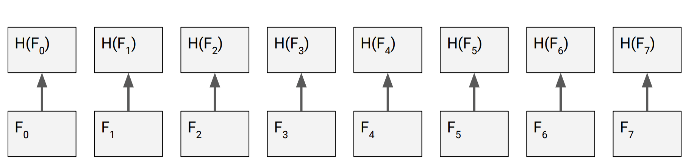

Problem: has to store n hashes → we need constant-sized digest

## Solution 2: Merkle Trees

Merkle tree

- the root is the digest, it is constant sized
    
    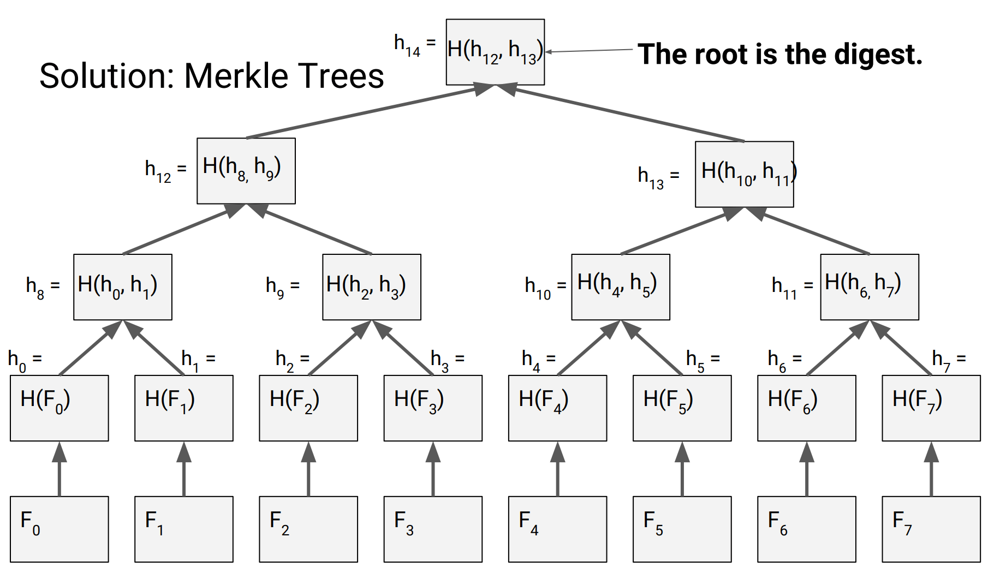
    
- use merkle proof to verify if the files have been changed.
    
    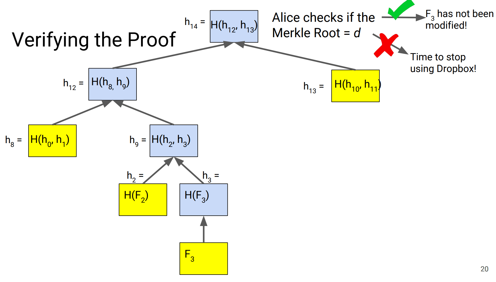
    

Performance

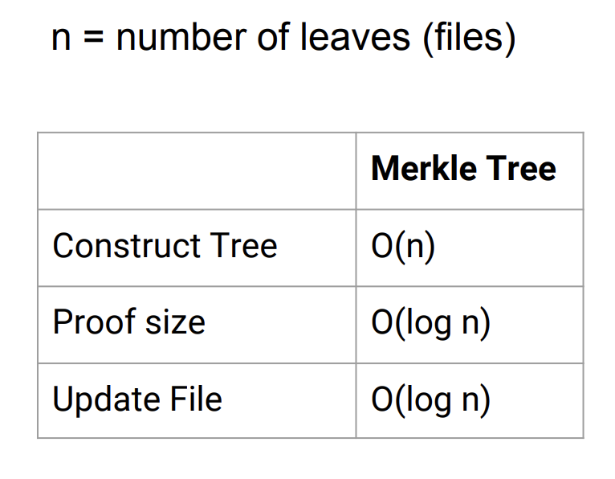

Problem: Many small files ⇒ Merkle proofs too large

## Solution 3: q-ary Merkle Trees

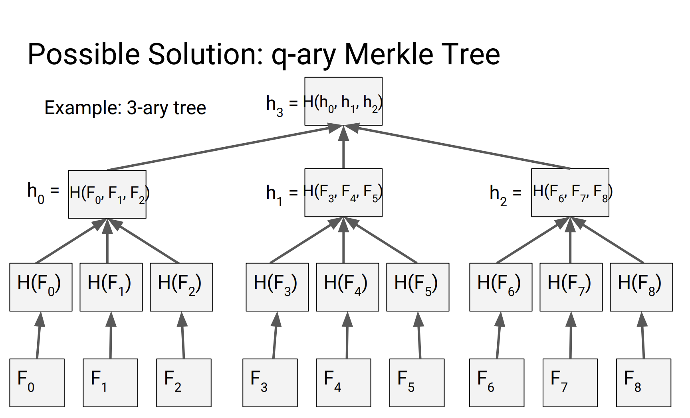

problem: Proof size is even bigger

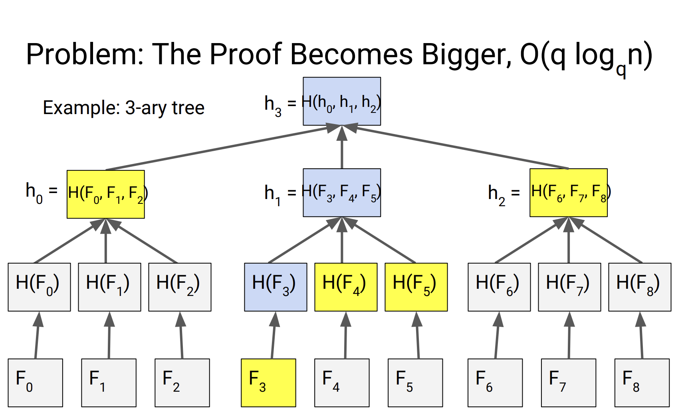

proof size:  $qlog_q{n}$

## Solution 4: polynomial commitment

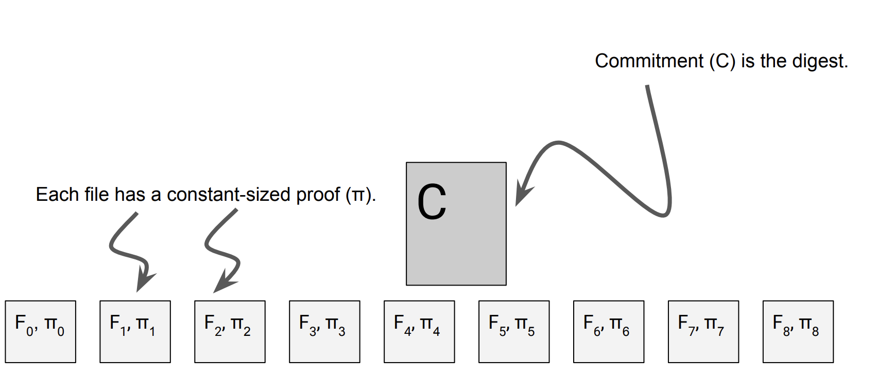

### What is polynomial commitments?

1. 将长度为 $n+1$ 的 vector 转换为多项式的点值 $(v_0, v_1, ..., v_n)$→$(0, v_0), (1, v_1), ...,(n, v_n)$
2. 将唯一对应的 $Degree=n$ 的多项式$f(x)$ ，生成为Commitment→ 拉格朗日插值
    - Lagrange Interpolation
        
        ## Polynomial
        
        $$
        f(x) = \sum_{i = 0}^{n} a_i x^i=a_0 + a_1x + ...+a_nx^n
        $$
        
        - Degree $deg(f(x))=n$
        - $a_n\neq0$
        
        ## Encoding data into Polynomial using Lagrange Interpolation
        
        Given $(x_i, y_i), x_i \neq x_j, \forall i\neq j$, build a polynomial such that $f(x_i) = y_i$ and degree is $n-1$
        
        $$
        f(x)=\sum_{i=0}^{n-1}y_i \prod_{j=0, j \neq i}^{n-1} \frac{x - x_j}{x_i - x_j}
        $$
        
        $n = 2$
        
        $$
        f(x)=y_0  \frac{x - x_1}{x_0 - x_1} + y_1 \frac{x - x_0}{x_1 - x_0}
        $$
        
        $n = 3$
        
        $$
        f(x)=y_0  \frac{(x - x_1)(x-x_2)}{(x_0 - x_1)(x_0-x_2)} + y_1 \frac{(x - x_0)(x-x_2)}{(x_1 - x_0)(x_1-x_2)} ...
        $$
        
        Example
        
        - Given (0, 3), (1, 6), we have
        
        $$
        f(x) = 3(x-1)/(0-1) + 6(x-0)/(1-0) = -3x+3+6=3x+3
        $$
        
        (2, 9), (3, 12), (4, 15).  Suppose, given (1,6) and (3,12)
        
        $$
        f(x)= 6(x-3)/(1-3)+12(x-1)/(3-1)=-3x+9+6x-6=3x+3
        $$
        
        n encode to m (m > n), n-of-m data can recover the polynomial **exactly**!
        
3. Open 其中的一个点，提供一个 Proof 证明点值$(k,v_k)$符合多项式$f(k)=v_k$


STUART → (1, 83), (2, 84), …, (6, 84) → f(x) → choose (4.5, 69.5) as commitment

### KZG polynomial commitment

```jsx
Knowledge -> Point-Values -> Coefficients -> Commitment -> Open&Prove&Verify
                         FFT             MSM
                                          ^
                                          |
                                    Trusted Setup
```

FFT: Fast Furious Transform

MSM: multi-scalar multiplication

1. KZG Commitment 是 Polynomial Commitment 的一种算法实现
    - **Elliptic curves + discrete logarithm problem**
        
        Encoding Polynomial in a finite field $\mathbb{F}_q$,  q is prime:
        
        Polynomial on an elliptic curve $\mathbb{G}_1$
        
        $\mathbb{G}_1 = [0, G_1, G_1 + G_1 = [2] G_1, [3]G_1, ..., [q]G_1]$ where $[q+1] G_1 = 0$
        
        - $[n]G_1 =[n]_1$ can be computed very fast
        - $[n] X = Y$, given $X$ and $Y$, it is very hard to find $n$ (it is called discrete logarithm algorithm)
        - mod 7:
            - 1 mod 7, 8 mod 7, 15 mod 7,….
            - [n] mod 7 = 1 mod 7?
        
        $$
        [f(x)]G_1 = [\sum_{i=0}^{n}a_i x^i] G_1 = \sum_{i=0}^{n} [a_i] ([x^i] G_1) = \sum_{i=0}^{n} [a_i] [x^i]_1
        $$
        
    - **Trusted setup**
        
        
        
        Now we have secret $s \in \mathbb{F}_q$ such that
        
        - Nobody knows $s$ (private key of the “god”)
        - $[s^i] G_1 = [s^i]_1$, $i = 1, …$ is known to everybody (”god”’s public key)
        
        Then, we have the commitment as
        
        $$
        C = [f(s)]_1=\sum_{i=0}^n [a_i] [s^i]_1
        $$
        
        Finding another $g(x)$ such that $g(s) = f(s)$ is almost impossible
        
    - **Elliptic curves pairings**
        
        Find two elliptic curves, such that
        
        
        
        Given $x_i, y_i$, want to prove $f(x_i) = y_i$, 
        
        $$
        f(x) - y_i = g(x) = (x - x_i)q(x)
        $$
        
        3x+3 given data points( 1, 6), (4,2)
        
        $3x+3 - 6 = 3x-3 = 3(x-1)= q(x)(x-1)$
        
        $$
        \begin{aligned}[f(s) - y_i] G_1 &= [(s - x_i)q(s)] G_1 \\ C - [y_i]_1 \end{aligned}
        $$
        
        $e: \mathbb{G}_1 \times \mathbb{G}_2 \rightarrow \mathbb{G}_T$
        
        $$
        e(C - [y_i] G_1, G_2) = e([q(s)]_1, [(s - x_i)]_2)
        $$
        
        where $[q(s)]_1$ is the proof (48 bytes as a point on an elliptic curve)
        
        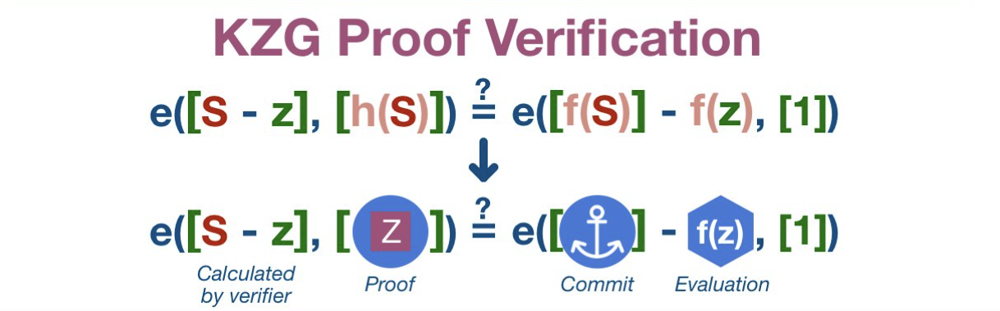
        
2. Polynomial Commitment 的其他实现
    1. KZG：PLONK、Marlin
    2. FRI：zkSTARK
    3. IPA：Bulletproof
    4. IPA + Halo-style aggregation：Halo 2
    
    ](imgs/175/polynomial_commitment_perf.png)
    
    [https://vitalik.ca/general/2021/11/05/halo.html](https://vitalik.ca/general/2021/11/05/halo.html)
    
3. KZG Commitment的优缺点
    1. 缺点：需要Trusted Setup
    2. 优点：proof 长度短且恒定

## Solution 5: Verkle trie

Replace Hash Functions in q-ary Merkle tree with Vector commitment Schemes → Verkle Trie

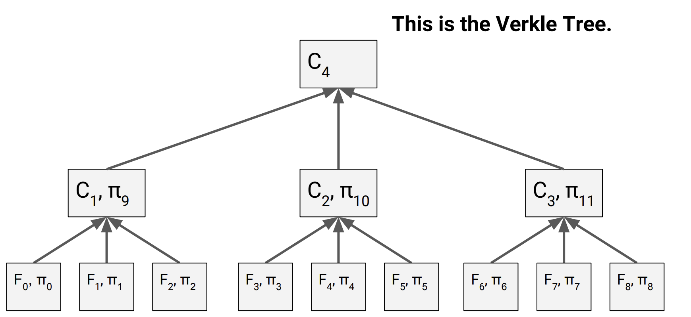

Performance comparison:

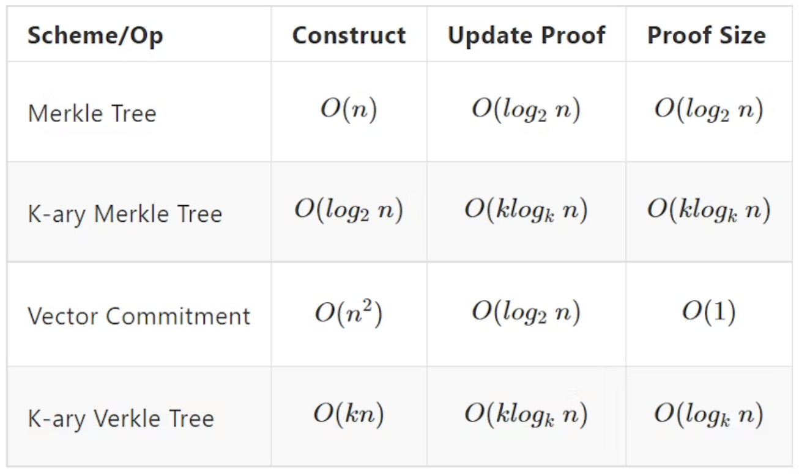

Verkle Trees let us trade off proof-size vs. construction time.

## Verkle tree structure in Ethereum

### MPT(Merkle Patricia Trie) problem

Ethereum has a total of four trees:

- the World State Trie
- Receipts Trie
- Transaction Trie
- Account Storage Trie

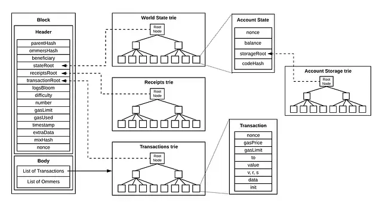

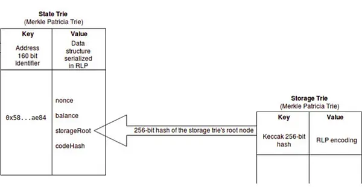

**MPT is 2-layer structure (Tree-inside-a-tree)**

- Complexity
- Imbalance
- Difficulty in understanding interactions between mechanisms such as state expiration

Vitalik has proposed a **single-layer structure**.

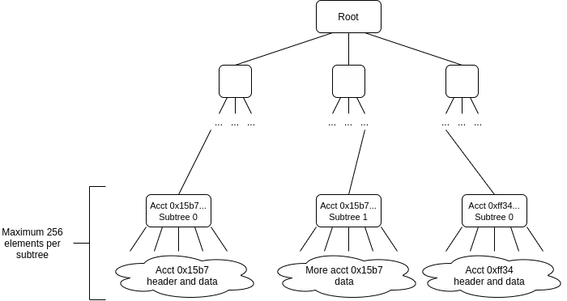

maps data to a 32-byte single key at all locations within the state:

eg. `(address, storage_slot)`, `(address, NONCE)`, `(address, balance)`,…

values sharing the first 31 bytes of the key are included in the same bottom-layer commitment.

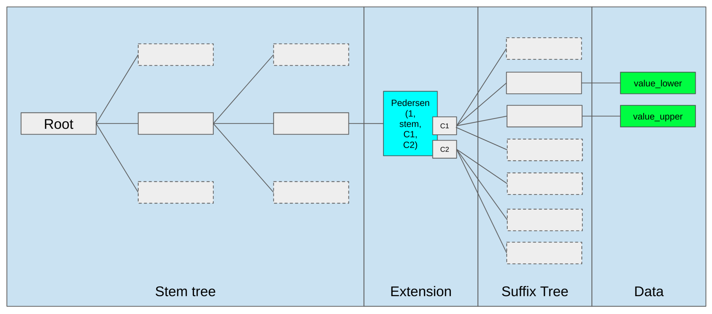

### Tree key

- 32 bytes
- consisting of a 31-byte stem and a 1-byte suffix. The suffix allows for distinguishing the state information (account header data, code, storage) stored by the Tree Key.
- 31-byte stem: pedersen_hash
    
    ```jsx
    def get_tree_key(address: Address32, tree_index: int, sub_index: int):
        # Asssumes VERKLE_NODE_WIDTH = 256
        return (
            pedersen_hash(address + tree_index.to_bytes(32, 'little'))[:31] +
            bytes([sub_index])
        )
    ```
    

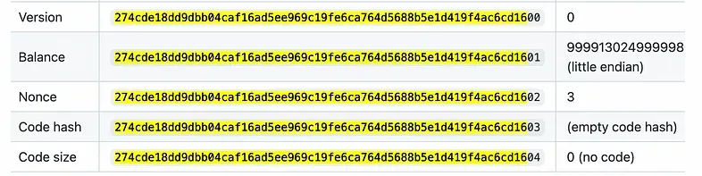

verkle tree structure:

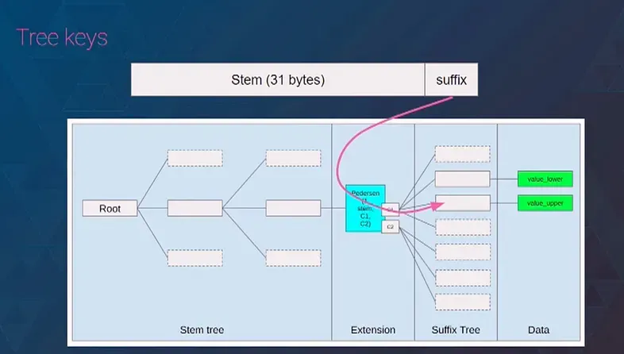

### **Inner Node & Suffix Node(extension node)**

***Suffix Node***

suffix node structure:

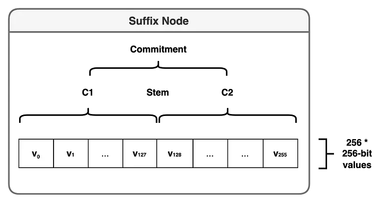

- **1:** A marker for the suffix node, which is 1 on the elliptic curve but does not literally mean the number 1.
- **Stem:** The stem refers to the stem in the tree key.
- **C1, C2:** Are Pedersen Commitments.

```jsx
C = Commit(1, C1, Stem, C2)
```

C1 and C2 commitment take the data form:

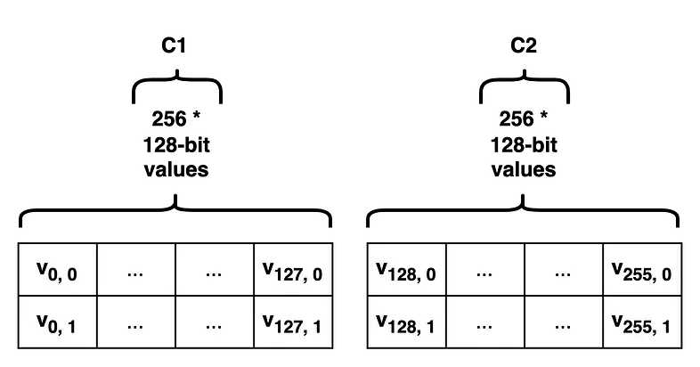

- The reason for this division is that the creation of Pedersen Commitment is limited to committing up to 256 values of maximum 253-bit size, and for 256-bit values, data loss occurs.
- Process of storing 32-byte data under a tree key:
    1. Depending on the suffix, the data become v0, v1… v255
    2. v0~v127 are included in C1, and v128~v255 are included in C2 to calculate the leaf node’s commitment
    3. For C1, each 32-byte value of v0~v127 is divided into the upper 16 bytes (v1,0) and the lower 16 bytes (v1, 1) to serve as coefficients in a polynomial. 
        
        → each coefficient’s data being 16 bytes (128-bit)
        
    4. 256-degree polynomial is committed:
        - `C1 = commit([(v0,0), (v0,1), (v1,0), (v1,1)…(v127,0),(v127,1)])`
        - `C2 = commit([(v128,0), (v128,1), (v129,0), (v129,1) … (v255,0),(v255,1)])`
    5. `C = Commit(1, C1, Stem, C2)` → commitment for the leaf node

***Inner Node***

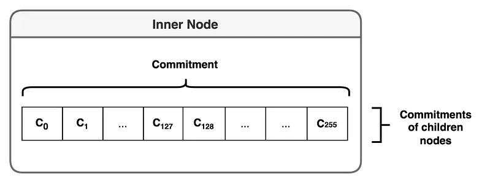

- holds the stem value of the tree key and stores 256 pointers to sub-nodes
- C0, C1 … C255 represent the commitments of sub-nodes, and the inner node contains these commitments.

An example of verkle tree containing 4 tree keys:

- 0x00..20
- 0xdefe…64
- 0xde03a8..02
- 0xde03a8..ff

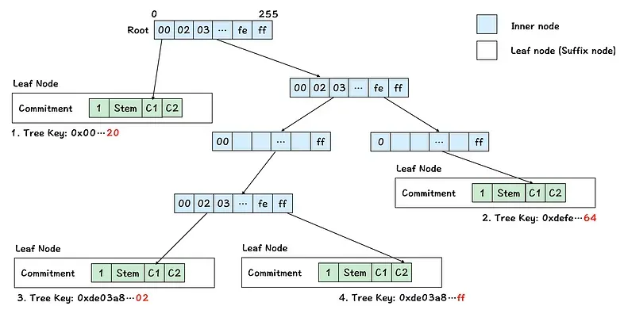

Summary:

- The Verkle Trie consists of two types of nodes: leaf nodes and inner nodes.
- A tree key contains a stem and a suffix.
- The same stem corresponds to the same leaf node.
- Data is stored differentiated by the suffix of the tree key.
- The tree key is encoded byte by byte along the path from the root to the leaf node.
- Data is included in the commitment of the leaf node.


[View on GitHub](https://github.com/qiwihui/blog/issues/175)


